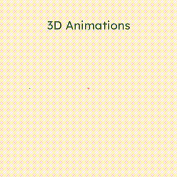

# ProSVG - Programmatic SVG with Python

This module works using Python's native xml module, with functions and classes to intuitively create SVG graphics

One of the goals of this module is to easily plot mathematical functions using svg `<path>` tags.

## Animations

  
  

With a focus on geometry and mathematics, svg objects can be animated with this module.

[View the complete animation](demo/demo.gif)

## How it Works

Similar to [3blue1brown's manim](https://github.com/3b1b/manim), the animation module renders the svg file as an image and pipes it to ffmpeg.

1. Increase animation time by $\text{dt}$
2. Update svg objects (transformations, movement, etc.)
3. If an animation has exceeded its runtime, it will be removed from the object
4. Convert svg to png using [CairoSVG](https://cairosvg.org)
5. Pipe png image to [FFmpeg](https://ffmpeg.org)
6. Repeat until the animation ends

